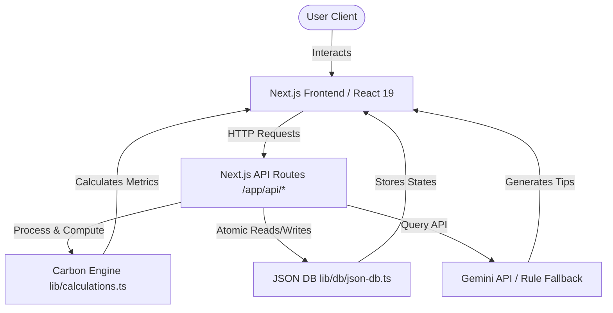

# EcoSphere — Carbon Footprint Tracker

EcoSphere is a premium, state-of-the-art Carbon Footprint Tracker and Sustainability Platform built with **Next.js 15**, **TypeScript**, and **Tailwind CSS**. It enables users to assess their annual baseline carbon footprint, log daily eco-friendly habits, track long-term trends, challenge themselves with community goals, and offset their emissions through sustainable project investments.

---

## 🔗 Live Demo & Deployment

You can deploy EcoSphere with one click to Vercel:

[](https://vercel.com/new/clone?repository-url=https%3A%2F%2Fgithub.com%2Fsoham53crtl%2Fcarbon-footprint-tracker-ai)

*Once deployed, you can access your live application link here: [https://carbon-footprint-tracker-ai.vercel.app](https://carbon-footprint-tracker-ai.vercel.app)*

---

## 📸 Screenshots

Here is a visual tour of the EcoSphere experience:

### 1. Interactive Action Dashboard


### 2. Onboarding Carbon Baseline Calculator


### 3. AI Eco Chatbot


---

## 🌟 Key Features

1. **Intelligent Baseline Calculator**
   - Step-by-step onboarding wizard assessing home utilities (electricity, gas, water), transportation habits (car travel, public transit, flights), diet types, and recycling routines.
   - Dynamic classification (Paris Target-aligned vs. moderate vs. high emissions).

2. **Gamified Action Hub & Dashboard**
   - Quick logging of daily carbon-saving habits.
   - Levelling engine, streak tracking, Green Coins, and milestone achievement badges (e.g., *Carbon Minimalist*, *Zero-Waste Champ*).
   - Dynamic data visualization via beautiful interactive Recharts area charts, donuts, and comparison bars.

3. **Active Challenges & Roadmap**
   - Difficulty-tiered sustainability challenges to maintain streaks and earn XP.
   - Comprehensive multi-phase structural roadmaps guiding users from basic switches to advanced carbon-neutral living.

4. **AI-Powered Eco Chatbot**
   - Interactive conversational agent powered by Google Gemini API (with elegant semantic rule-based local fallbacks if offline/unconfigured).

5. **Green Rewards Marketplace & Offsets**
   - Spend earned Green Coins on real-world rewards (e.g., reusable bottles, solar chargers).
   - Simulated carbon offset catalog mapping to UN Sustainable Development Goals (SDGs).

---

## 📐 System Architecture

Below is the conceptual architecture diagram of the EcoSphere platform:



---

## 🛠️ Tech Stack & Decisions

- **Core**: Next.js 15 (App Router), React 19, TypeScript
- **Styling**: Tailwind CSS with customized glassmorphic variables, micro-animations, and fluid responsive design tokens
- **Data Persistence**: Core JSON Database Engine (`lib/db/json-db.ts`) with thread-safe atomic reading and writing
- **Security**: 
  - OWASP-hardened authentication framework (`lib/auth/auth-service.ts`)
  - Password hashing utilizing Node's native `scrypt` key derivation function
  - Stateless JSON Web Tokens (JWT) signed using HMAC-SHA256
  - Support for both secure HTTP-only cookies and Authorization headers
- **No Native Binary Dependencies**: Zero SQLite, zero bcrypt dependencies, ensuring seamless setup on all operating systems without build issues.

---

## 🚀 Getting Started

### Prerequisites

- Node.js v18.17.0 or newer
- npm or yarn

### Installation

1. Install dependencies (utilizing legacy peer dependencies due to Next.js 15 / React 19 RC alignment):
   ```bash
   npm install --legacy-peer-deps
   ```

2. Create a `.env.local` file in the root directory and add your keys (optional):
   ```env
   JWT_SECRET=your_super_secure_jwt_secret_phrase_at_least_32_chars
   GEMINI_API_KEY=your_google_gemini_api_key_optional
   ```

3. Run the development server:
   ```bash
   npm run dev
   ```
   Open [http://localhost:3000](http://localhost:3000) in your browser to view the application.

4. Build the application for production:
   ```bash
   npm run build
   ```

---

## 🧪 Running Tests

A comprehensive suite of unit tests validates the carbon calculation engine, habit thresholds, and badges logic.

Run the Jest tests using:
```bash
npm test
```
