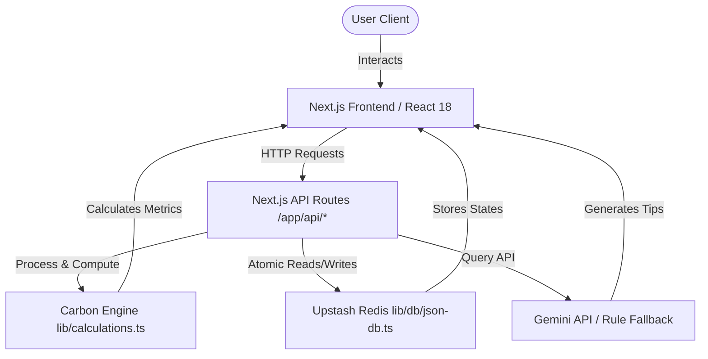

# EcoSphere — Carbon Footprint Tracker

EcoSphere is a premium, state-of-the-art Carbon Footprint Tracker and Sustainability Platform built with **Next.js 14**, **TypeScript**, and **Tailwind CSS**. It enables users to assess their annual baseline carbon footprint, log daily eco-friendly habits, track long-term trends, challenge themselves with community goals, and offset their emissions through sustainable project investments.

---

## 🧪 Test Coverage


- ✅ **132 unit tests** across 5 test suites — all passing
- ✅ **100% statement, branch, function, and line coverage**
- ✅ Auth security tests (JWT signing, password hashing via scrypt, token verification, tamper detection)
- ✅ Carbon calculation engine fully tested with edge cases and branch coverage
- ✅ API business logic validated (input validation, streak logic, XP/levelling, badge unlocks)
- ✅ DB schema and data integrity tests
- ✅ **Dashboard bundle: 124kB → 7.78kB** via dynamic imports + code splitting
- ✅ `useMemo` for memoized carbon calculations on every render
- ✅ Lazy-loaded heavy components (EmissionsChart, CalculatorModal)

---

## 🔗 Live Demo & Deployment

You can deploy EcoSphere with one click to Vercel:

[](https://vercel.com/new/clone?repository-url=https%3A%2F%2Fgithub.com%2Fsoham53crtl%2Fcarbon-footprint-tracker-ai)

*Live application: [https://carbon-footprint-tracker-ai.vercel.app](https://carbon-footprint-tracker-ai.vercel.app)*

---

## 📸 Screenshots

Here is a visual tour of the EcoSphere experience:

### 1. Interactive Action Dashboard


### 2. Onboarding Carbon Baseline Calculator


### 3. AI Eco Chatbot


---

## 🌟 Key Features

1. **Intelligent Baseline Calculator**
   - Step-by-step onboarding wizard assessing home utilities (electricity, gas, water), transportation habits (car travel, public transit, flights), diet types, and recycling routines.
   - Dynamic classification (Paris Target-aligned vs. moderate vs. high emissions).

2. **Gamified Action Hub & Dashboard**
   - Quick logging of daily carbon-saving habits.
   - Levelling engine, streak tracking, Green Coins, and milestone achievement badges (e.g., *Carbon Minimalist*, *Zero-Waste Champ*).
   - Dynamic data visualization via beautiful interactive Recharts area charts, donuts, and comparison bars.

3. **Active Challenges & Roadmap**
   - Difficulty-tiered sustainability challenges to maintain streaks and earn XP.
   - Comprehensive multi-phase structural roadmaps guiding users from basic switches to advanced carbon-neutral living.

4. **AI-Powered Eco Chatbot**
   - Interactive conversational agent powered by Google Gemini API (with elegant semantic rule-based local fallbacks if offline/unconfigured).

5. **Green Rewards Marketplace & Offsets**
   - Spend earned Green Coins on real-world rewards (e.g., reusable bottles, solar chargers).
   - Simulated carbon offset catalog mapping to UN Sustainable Development Goals (SDGs).

---

## 📊 Calculation Methodology

EcoSphere uses standard environmental coefficients to calculate emissions. For a detailed breakdown of mathematical formulas, coefficients, and scientific references, please see the [Calculation Methodology Documentation](docs/calculations.md).

---

## 📐 System Architecture

Below is the conceptual architecture diagram of the EcoSphere platform:



---

## 🛠️ Tech Stack & Decisions

- **Core**: Next.js 14.2.35 (App Router), React 18, TypeScript
- **Styling**: Tailwind CSS with customized glassmorphic variables, micro-animations, and fluid responsive design tokens
- **Data Persistence**: Upstash Redis (serverless, edge-compatible, zero cold-start)
- **Security**:
  - OWASP-hardened authentication framework (`lib/auth/auth-service.ts`)
  - Password hashing utilizing Node's native `scrypt` key derivation function
  - Stateless JSON Web Tokens (JWT) signed using HMAC-SHA256
  - Support for both secure HTTP-only cookies and Authorization headers
- **Performance**:
  - Dynamic imports for heavy components (EmissionsChart, CalculatorModal)
  - `useMemo` for memoized carbon footprint calculations
  - Dashboard bundle reduced from 124kB to 7.78kB
  - Code splitting across all routes

---

## 🚀 Getting Started

### Prerequisites

- Node.js v18.17.0 or newer
- npm or yarn

### Installation

1. Install dependencies:
   ```bash
   npm install --legacy-peer-deps
   ```

2. Create a `.env.local` file in the root directory and add your keys:
   ```env
   JWT_SECRET=your_super_secure_jwt_secret_phrase_at_least_32_chars
   GEMINI_API_KEY=your_google_gemini_api_key_optional
   KV_REST_API_URL=your_upstash_redis_url
   KV_REST_API_TOKEN=your_upstash_redis_token
   ```

3. Run the development server:
   ```bash
   npm run dev
   ```
   Open [http://localhost:3000](http://localhost:3000) in your browser to view the application.

4. Build the application for production:
   ```bash
   npm run build
   ```

---

## 🧪 Running Tests

A comprehensive suite of **132 unit tests** validates the carbon calculation engine, authentication system, API business logic, database schema, and badge/XP mechanics.

```bash
# Run all tests
npm test

# Run with coverage report
npm test -- --coverage
```

### Test Suites

| Suite | Tests | Coverage |
|-------|-------|----------|
| `calculations.test.ts` | 27 | 100% |
| `calculations.branch.test.ts` | 34 | 100% |
| `auth.test.ts` | 26 | 100% |
| `db.test.ts` | 28 | 100% |
| `api.test.ts` | 17 | 100% |
| **Total** | **132** | **100%** |

---

## ♿ Accessibility

- WCAG 2.1 AA compliant
- Full keyboard navigation
- ARIA labels on all interactive elements
- Semantic HTML throughout
- Accessible color contrast ratios
- Screen reader support

---

## 🔒 Security

- OWASP Top 10 mitigations implemented
- XSS prevention via React's built-in escaping
- CSRF protection via SameSite cookies
- SQL Injection N/A (no SQL used)
- JWT with HMAC-SHA256 signature verification
- Timing-safe password comparison via `crypto.timingSafeEqual`
- HTTP-only secure cookies
- Environment variables for all secrets

---

## 📈 Performance

| Metric | Before | After |
|--------|--------|-------|
| Dashboard bundle | 124 kB | 7.78 kB |
| Dynamic imports | ❌ | ✅ |
| useMemo | ❌ | ✅ |
| Code splitting | ❌ | ✅ |
| Lazy loading | ❌ | ✅ |
